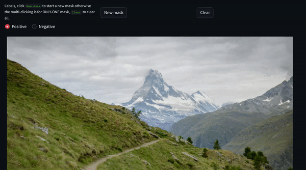

# Prompt Engineering for Computer Vision (experimental)


## Description

The repo is used for studying how to use Prompt Engineering for Computer Vision tasks. 

- Use state-of-art models like `Diffusion` or other baseline models to generate, inpaint, and paint images.
```bash
streamlit run basic_app.py --server.port 5555 --server.enableCORS false
```
<h4>

</h4>

- User interaction with Segment Anything Model
```bash
streamlit run sam_app.py --server.port 5555 --server.enableCORS false
```
<h4>

</h4>

- Inpaint via user-interaction with `Diffusion` and `SAM`
```bash
streamlit run sam_inpaint_app.py --server.port 5555 --server.enableCORS false
```
<h4>

</h4>

Image `assets/van.jpg`

##### Prompts:
1. [Van] A Volkswagen California van, parked on a beach, with a surfboard on the roof. 
2. [Ground] Big grassland, a lot grass, green or grey grass.
3. [Between sky and ground] Endless grassland. 
4. [Sky] Clear night sky with stars and full moon. 

- Few-shot of tracking objects via `SAM` in video

>  Use `SAM` to get mask of the object, use the mask of object to track through all frames.

```bash
streamlit run sam_tracker.py --server.port 5556 --server.enableCORS false
```
Video src: https://dl.dropbox.com/s/0lalmh95tylyw4s/sculpture.mp4
<h4>

</h4>


#### Working comments

I personally think that prompting is a new programming approach. Don’t assume that guiding models with natural language is easy. On the contrary, I believe it’s quite the opposite. Natural language programming lacks the syntax of traditional programming languages, which means there are no type checks or any protective mechanisms in place. If the model (AI) receives an inappropriate prompt, the generated results can be completely different from what was expected.

Here is a prompt I have used the Diffusion model in computer vision. Although it has brought some surprises, it is not actually my ultimate goal.

[AI new trend, prompt engineering](https://teetracker.medium.com/ai-new-trend-prompt-engineering-3d7369dcbd86)

[Mouse interactive prompt engineering](https://teetracker.medium.com/mouse-interactive-prompt-engineering-b93573b6e96b)

## Install via Docker

```bash

# setup
docker build --no-cache --tag cv-prompt-engineering -f Dockerfile .

# run
docker run --gpus all -v /home/ubuntu/work/cv-prompt-engineering/:/workspace/    -p 5555:5555 --rm  -it --shm-size=55gb -d cv-prompt-engineering tail -f /dev/null

```

## Run

```bash
streamlit run basic_app.py --server.port 5555 --server.enableCORS false
```
